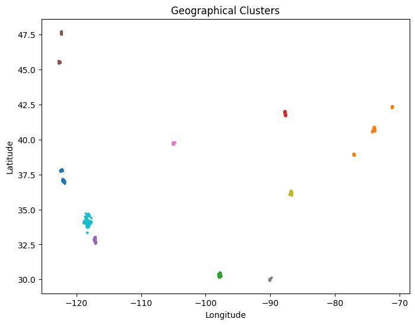
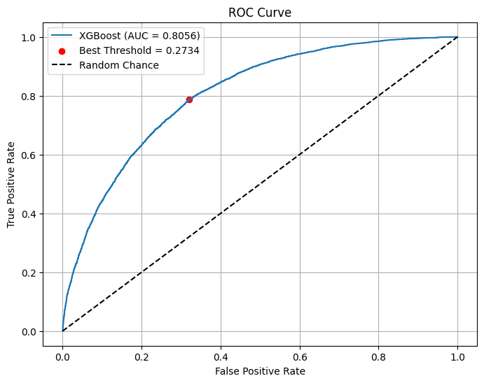

# Airbnb Perfect-Rating Classification

This repository contains an exploratory Colab notebook that builds binary
classifiers to predict whether an Airbnb listing has a perfect rating. The
target is `perfect_rating_score`, converted from `YES`/`NO` to `1`/`0`.

The notebook is experimental rather than a single clean pipeline. Its most
complete path is:

1. Load listing features, training labels, test listings, and a separate
   amenities file.
2. Engineer text, host, location, capacity, price, availability, policy, and
   review-age features.
3. Keep numeric columns and optionally inspect feature importance with Lasso
   and Random Forest.
4. Train XGBoost models.
5. choose a probability threshold based on the desired false-positive rate.

## Repository contents

| Path | Purpose |
| --- | --- |
| `Copy_of_Eeaman6.ipynb` | Original 121-cell Colab notebook |
| `docs/assets/geographical-clusters.png` | Geographic KMeans output extracted from the notebook |
| `docs/assets/xgboost-roc-curve.png` | XGBoost ROC output extracted from the notebook |
| `docs/assets/airbnb-ds-pipeline-overview.svg` | Conceptual nine-stage production ML pipeline |
| `docs/SVG_README.md` | SVG implementation, architecture mapping, and editing guide |

## End-to-end pipeline overview



See [the SVG implementation guide](docs/SVG_README.md) for the responsibilities
of each stage, how the notebook maps to the diagram, the SVG structure, and
instructions for extending or editing it.

The notebook references four data files that are not included:

- `airbnb_train_x.csv`
- `airbnb_train_y.csv`
- `airbnb_test_x.csv`
- `amenities_included.csv`

The saved output reports 92,067 training rows and 63 original columns after
joining the features and labels. Because the input CSVs are absent, the
notebook cannot currently be reproduced from this repository alone.

## Data and target

The source data describes listings through:

- listing text, such as the summary, description, rules, and host biography;
- host behavior and experience;
- city, latitude, longitude, property type, and room type;
- capacity, bedrooms, bathrooms, and beds;
- nightly, weekly, and monthly prices;
- availability windows;
- review history, cancellation policy, and license status; and
- derived amenity indicators from `amenities_included.csv`.

The principal target is:

```python
perfect_rating_binary = perfect_rating_score.map({"YES": 1, "NO": 0})
```

`high_booking_rate` is loaded but is not used as the target in the executed
modeling path.

## Feature engineering

| Feature group | Engineered fields and meaning |
| --- | --- |
| Text | Character length and word count for `summary`, `description`, `house_rules`, and `host_about` |
| Host | Biography-present flag, filled response rate, host tenure, and listing counts |
| Geography | Raw coordinates and a 10-group KMeans geographic cluster |
| Capacity | `room_score = 0.6 × bedrooms + 0.4 × bathrooms` and beds per guest |
| Price | Log price, price per included guest, and weekly/monthly price ratios |
| Availability | Sum of four availability windows divided by 545 |
| Policy | Ordinal cancellation code and one-hot-encoded room type |
| Listing age | Days since first review and a license-present flag |
| Amenities | Wi-Fi, kitchen, AC, heating, parking, TV, pet, essentials, safety, laundry, and total amenity score |

The notebook then selects numeric columns, fills missing values with zero, and
uses Lasso coefficients and Random Forest importance as feature-selection
experiments.

The saved Lasso output gives the largest positive coefficients to
`price_per_guest`, `host_years`, `bathrooms`, `room_score`, and `price`. The
largest negative coefficients are for `days_since_first_review`,
`host_response_rate`, `cancellation_encoded`, `availability_365`, and
`house_rules_word_count`. These are associations in the fitted model, not
causal effects.

## Geographic-cluster graph



This plot assigns listing coordinates to 10 KMeans clusters:

- Each point is a listing.
- Longitude is on the x-axis and latitude is on the y-axis.
- Color is the cluster ID, which is only a category and has no numeric rank.
- The separated groups correspond to geographically distant Airbnb markets
  across the United States.

The graph shows that coordinates can provide strong market-level information.
It does not show rating performance or cluster quality. Since KMeans uses
Euclidean distance directly on latitude and longitude, it is only a rough
geographic segmentation; projected coordinates, haversine distance, or
city-aware clustering would be more defensible.

## XGBoost model

The main saved model uses:

| Parameter | Value |
| --- | ---: |
| `max_depth` | 4 |
| `min_child_weight` | 3 |
| `gamma` | 0.2 |
| `subsample` | 0.8 |
| `colsample_bytree` | 0.8 |
| `learning_rate` | 0.05 |
| `n_estimators` | 300 |
| `reg_alpha` | 0.5 |
| `reg_lambda` | 1.0 |

It uses an 80/20 random train/holdout split with `random_state=42`.

### Saved performance

At a classification threshold of `0.49`, the notebook reports:

| Metric | Result |
| --- | ---: |
| Accuracy | 0.7691 |
| True-positive rate (recall) | 0.4335 |
| False-positive rate | 0.0956 |
| ROC AUC | 0.8056 |

The small eight-model grid search explicitly maximizes recall while requiring
`FPR <= 0.10`. Its best saved configuration uses depth 4 and
`min_child_weight=3`, producing approximately:

| Metric | Result |
| --- | ---: |
| Threshold | 0.454 |
| Accuracy | 0.755 |
| True-positive rate | 0.395 |
| False-positive rate | 0.100 |

## ROC graph



The ROC curve shows the true-positive rate available at each false-positive
rate:

- The dashed diagonal represents random ranking (`AUC = 0.5`).
- The blue curve is well above that line, with `AUC = 0.8056`, indicating
  useful discrimination between perfect and non-perfect ratings.
- The red point is threshold `0.2734`, selected by Youden's J statistic
  (`TPR - FPR`). From the graph it yields roughly 0.78 TPR and 0.32 FPR.
- Threshold `0.49` is not the red point. It implements a stricter operating
  policy, reducing FPR to 0.0956 at the cost of reducing TPR to 0.4335.

This is the central business tradeoff in the notebook. Use the Youden threshold
when sensitivity and specificity have similar value. Use the stricter
threshold when false positives must stay near or below 10%.

Selected values from the notebook's threshold sweep illustrate the tradeoff:

| Threshold | TPR | FPR |
| ---: | ---: | ---: |
| 0.40 | 0.5953 | 0.1743 |
| 0.45 | 0.5040 | 0.1280 |
| 0.49 | 0.4335 | 0.0956 |
| 0.50 | 0.4168 | 0.0885 |
| 0.55 | 0.3344 | 0.0607 |
| 0.60 | 0.2560 | 0.0407 |

## Other experiments

The notebook also contains:

- variance filtering with `VarianceThreshold`;
- Lasso-based feature selection;
- Random Forest feature importance and classification;
- an ROC graph for Random Forest;
- repeated XGBoost blocks with slightly different thresholds;
- a small manual XGBoost grid search; and
- a 34,992-combination XGBoost search with checkpointing.

The large search was manually interrupted at combination 2,047, so it did not
finish. The small search completed its model evaluations but ended with
`ModuleNotFoundError: ace_tools` while trying to display the result table.

## Important correctness issues

The saved metrics describe the recorded notebook run, but several code issues
must be fixed before treating the model as reproducible or production-ready:

1. **Incorrect test text features.** The test loop writes a literal
   `'{col}_len'` column and derives values from `train`, not `test_x`.
2. **Training data leaks into a test feature.** The test monthly discount uses
   `train['monthly_price']`.
3. **Inconsistent geographic labels.** KMeans is fitted separately on training
   and test data. Fit once on training coordinates and call `predict` for test
   coordinates.
4. **Amenities are effectively unused.** `model_ready` is created before
   amenities are appended, and the later `X` is built from `model_ready`.
5. **Unsafe row-wise concatenation.** Amenities are joined by reset row
   position, with no listing key or row-count validation.
6. **Validation overfitting.** Thresholds and hyperparameters are selected on
   the same 20% holdout used to report metrics. Use train/validation/test splits
   or nested cross-validation.
7. **Unstratified split.** `train_test_split` should use `stratify=y` for a
   binary target, especially if classes are imbalanced.
8. **Lasso is a regression model.** For binary feature selection, L1-penalized
   logistic regression is a better match.
9. **Preprocessing is fragmented.** Several later cells depend on variables
   created in different experimental branches and cannot be run cleanly from
   top to bottom.
10. **Raw test prediction has incompatible columns.** One cell passes raw
    `test_x` into a model trained on numeric `X`; the later preprocessing block
    does not recreate the exact training feature pipeline.
11. **Invalid checkpoint path.** `to_csv` receives a Google Drive sharing URL,
    not a mounted filesystem path.
12. **Time-dependent constants.** Host tenure and review age use hard-coded
    2025 dates. A named, fixed reference date should be used consistently.

## Recommended reproducible pipeline

For a clean implementation:

1. Join features, labels, and amenities by a stable listing ID.
2. Split once into stratified train, validation, and test sets.
3. Put all transformations in a fitted preprocessing pipeline.
4. Fit KMeans and categorical encoders only on training data.
5. Tune model hyperparameters on cross-validation within the training set.
6. Select the probability threshold on the validation set using an explicit
   constraint such as `FPR <= 0.10`.
7. Report AUC, accuracy, TPR, FPR, precision, and a confusion matrix once on
   the untouched test set.
8. Refit the final pipeline as needed and apply that same fitted object to the
   external test CSV.

## Environment

The notebook requires Python 3 and the following primary packages:

```text
numpy
pandas
matplotlib
seaborn
scikit-learn
xgboost
```

It was written for Google Colab, as shown by the `google.colab.drive` import.
The `ace_tools` display call is nonstandard and can be replaced with
`display(df_results)` or `print(df_results)`.
