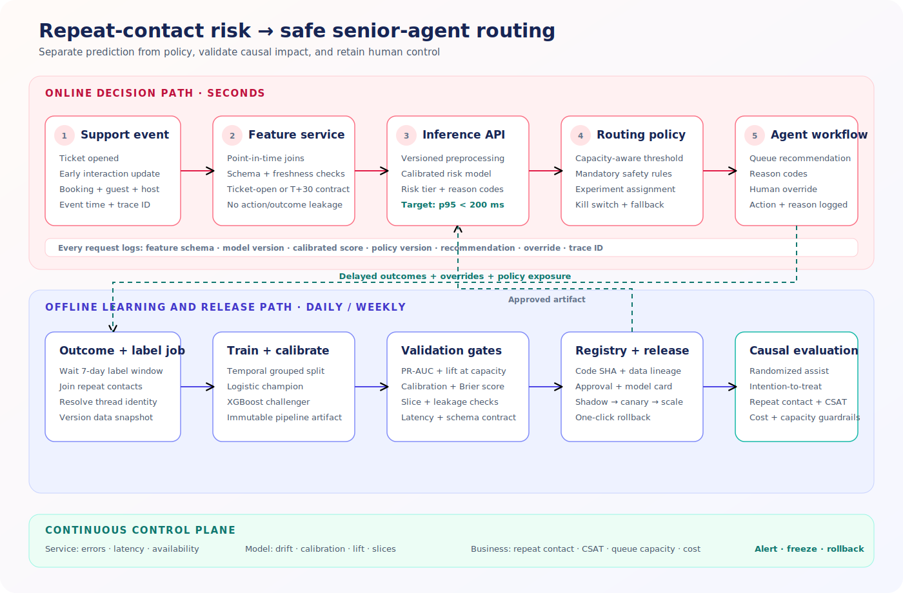

# Production Rollout: Repeat-Contact Risk and Senior-Agent Routing



## Executive recommendation

Deploy this work first as a **decision-support system**, not an autonomous
routing system. The model should rank open support tickets by the probability
of repeat contact within seven days, show agents a small set of reason codes,
and recommend—but not force—senior routing.

The rollout should proceed through four controlled stages:

1. **Offline validation:** rebuild the model on production-like, point-in-time
   data and pass quality, calibration, fairness, and leakage checks.
2. **Shadow mode:** score live tickets without changing queues or agent
   behavior.
3. **Assisted routing experiment:** expose recommendations to a randomized
   treatment group while preserving agent override.
4. **Graduated production rollout:** expand only if repeat contact improves
   without harming response time, customer satisfaction, safety, cost, or
   senior-agent capacity.

The current repository is a synthetic proof of concept. Its results are useful
for architecture and experiment design, but they are not evidence that the
policy will improve outcomes on real Airbnb support traffic.

## What the prototype demonstrates

The notebooks predict `repeat_contact_7d`, which has a synthetic prevalence of
37.15%.

| Model | ROC-AUC | PR-AUC | Production implication |
| --- | ---: | ---: | --- |
| Logistic regression | 0.7186 | 0.6076 | Best current baseline; simpler to calibrate, explain, and operate |
| Random Forest | 0.7165 | 0.6045 | No material gain over the baseline |
| XGBoost | 0.7061 | 0.5920 | Useful explainability demonstration, but not the best validated model |

The XGBoost top-risk decile has a 70.8% repeat-contact rate versus a 37.16%
overall rate, or 1.91× lift. Routing the top 10% would identify 19.05% of
observed repeat contacts in the holdout sample.

These are model-ranking results. They do **not** show that senior routing causes
fewer repeat contacts.

## Blocking issues before production

### 1. Remove action and post-decision leakage

The prototype feature matrix includes `senior_agent_routing` and
`rebooking_coupon_offered`. A model used to recommend those actions cannot use
them as inputs. They must be excluded from the risk model.

The prototype also includes:

- `time_to_first_agent_response_minutes`
- `message_count_first_30min`
- `sentiment_score`
- `urgency_score`

These fields are only valid if the score is intentionally produced after the
required messages and response events exist. Production must define explicit
score moments:

| Score | Time | Allowed inputs | Intended use |
| --- | --- | --- | --- |
| `ticket_open_risk` | Ticket creation | Booking, issue, channel, guest, host, listing, and check-in context | Initial queue placement |
| `early_interaction_risk` | Approximately 30 minutes later | Ticket-open features plus message-derived sentiment, urgency, response time, and message count | Escalation or specialist review |

Each model needs a separate feature contract. Missing future fields must never
be silently replaced with values that imply an event already occurred.

### 2. Replace the random split

Real evaluation should use a time-based split:

- train on older tickets;
- validate thresholds on a later period; and
- test once on the newest untouched period.

Group related contacts by booking or ticket thread so the same support episode
cannot appear in both training and evaluation data.

### 3. Calibrate probabilities

Queue capacity and expected benefit depend on reliable probabilities, not only
ranking. Evaluate calibration curves and Brier score, then use isotonic or
Platt calibration fitted on validation data. Monitor calibration by market,
issue type, channel, and customer segment.

### 4. Establish causal evidence

The causal notebook currently:

- shows strong confounding in who receives senior routing;
- fits a propensity model with AUC 0.681;
- reports an optimizer convergence warning; and
- does not calculate an adjusted treatment effect.

The near-zero naive difference in repeat-contact rates is not a causal
estimate. Senior agents receive more urgent and safety-related tickets, so a
simple routed-versus-not-routed comparison is biased.

Use a randomized controlled trial where operationally and ethically safe.
Estimate intention-to-treat effects for repeat contact, CSAT, escalation,
resolution time, and cost. Keep safety issues and mandatory escalation rules
outside randomization.

## Target production architecture

The companion SVG shows two connected paths:

- an **online path** that builds point-in-time features, scores a ticket, applies
  capacity and safety policy, and displays a recommendation; and
- an **offline path** that waits seven days for labels, trains and validates a
  versioned pipeline, runs a randomized policy evaluation, and promotes an
  approved artifact through a registry.

The deployable unit must contain preprocessing, feature order, category
handling, calibration, and the classifier in one immutable artifact. Do not
reimplement notebook preprocessing in the API.

## Online inference contract

An event-driven service is appropriate because routing is triggered when a
ticket opens or when early interaction signals become available.

Example request:

```json
{
  "ticket_id": "T123456",
  "score_moment": "ticket_open",
  "event_time": "2026-07-01T18:30:00Z",
  "issue_category": "host_cancellation",
  "contact_channel": "chat",
  "priority_initial": "high",
  "booking": {
    "days_until_checkin": 2,
    "nights": 4,
    "total_value": 980.0
  },
  "guest": {
    "account_age_days": 850,
    "past_support_tickets_12m": 2
  },
  "host": {
    "response_rate": 0.71,
    "cancellation_rate_12m": 0.09
  }
}
```

Example response:

```json
{
  "ticket_id": "T123456",
  "model_version": "repeat-contact-open-2026-07-01.3",
  "feature_schema_version": "ticket-open-v1",
  "repeat_contact_risk": 0.78,
  "risk_tier": "high",
  "recommendation": "senior_review",
  "reason_codes": [
    "check_in_within_7_days",
    "host_cancellation_issue",
    "elevated_host_cancellation_history"
  ],
  "policy_version": "routing-policy-v1",
  "trace_id": "01J2..."
}
```

Reason codes should come from a versioned, tested mapping. They are operational
explanations, not causal claims and not raw SHAP values shown directly to
agents.

## Decision policy

Keep model risk and routing policy separate:

```text
recommend senior review when
    calibrated_risk >= threshold
    AND senior_capacity_available
    AND ticket is eligible for experimentation
    AND no mandatory rule has already determined routing
```

The threshold should be selected from expected benefit and capacity, not fixed
at `0.50`. A practical daily policy can route the highest-risk eligible tickets
up to a capacity limit while enforcing:

- mandatory safety and legal escalation rules;
- per-market and per-channel capacity;
- maximum queue-age and response-time guardrails;
- protection against repeatedly deprioritizing specific segments; and
- a randomized holdout for measuring incremental effect.

Log the raw score and the final policy decision separately. Otherwise model
quality cannot be distinguished from capacity constraints or business rules.

## Training and release pipeline

1. **Labeling:** after the seven-day observation window, mark whether a ticket
   generated a qualifying repeat contact.
2. **Point-in-time feature join:** use only values available at the selected
   score moment.
3. **Data validation:** enforce schema, ranges, null rates, category sets,
   uniqueness, and label-window completeness.
4. **Training:** fit preprocessing and candidate models with fixed seeds and
   tracked dependency versions.
5. **Evaluation:** compare against the current champion on temporal holdout
   data and operational slices.
6. **Calibration and policy simulation:** fit calibration on validation data
   and simulate capacity-aware thresholds.
7. **Registration:** record code SHA, data snapshot, schema version, metrics,
   calibration artifact, owner, and approval.
8. **Canary:** deploy the challenger to shadow traffic before any policy
   exposure.
9. **Promotion or rollback:** use explicit gates and retain the prior artifact
   for immediate rollback.

Start with logistic regression as the production champion because it currently
has the strongest validation metrics and the lowest operational complexity.
Treat XGBoost as a challenger only after it beats the champion on temporal,
calibrated, production-like evaluation.

## Rollout phases and gates

| Phase | Exposure | Required evidence to advance |
| --- | --- | --- |
| 0. Offline | Historical data only | No leakage; stable temporal performance; calibrated risk; acceptable slice metrics |
| 1. Shadow | 100% scored, 0% acted on | ≥99.9% successful scoring; p95 latency target met; feature parity; stable score distribution |
| 2. Agent preview | Small internal cohort | Reasons are understandable; override reasons collected; no workflow or safety regressions |
| 3. Randomized assist | Eligible tickets split treatment/control | Statistically and operationally meaningful reduction in repeat contact with guardrails intact |
| 4. Limited production | One or two markets/channels | Capacity remains stable; effect replicates; monitoring and rollback are exercised |
| 5. Graduated scale | 5% → 25% → 50% → 100% | Each step passes model, business, fairness, reliability, and cost gates |

Use a kill switch that disables model recommendations while preserving existing
mandatory routing rules.

## Experiment design

Randomize at the ticket or support-thread level and keep assignment stable
across repeat contacts. The treatment is exposure to the model-assisted routing
policy, not merely a high model score.

Primary metric:

- repeat contact within seven days.

Guardrails:

- time to first response;
- resolution time;
- escalation rate;
- CSAT;
- safety-policy compliance;
- senior-agent utilization and queue depth;
- cost per resolved ticket; and
- outcomes by market, issue type, channel, language, and relevant protected or
  risk-sensitive segments.

Measure both recommendation assignment and actual agent action. Report
intention-to-treat as the primary causal result and treatment-on-the-treated
only with a defensible compliance analysis.

## Monitoring

### Service health

- request volume, error rate, timeout rate, and retry rate;
- p50, p95, and p99 latency;
- feature-store availability and staleness;
- model and policy version distribution; and
- fallback and override rates.

### Data and model health

- schema violations and missing features;
- unknown-category frequency;
- score distribution and population drift;
- calibration and Brier score after labels mature;
- ROC-AUC, PR-AUC, lift, precision at capacity, and recall at capacity; and
- all metrics by key operational slices.

### Business impact

- seven-day repeat-contact rate;
- CSAT, escalation, resolution time, and first-response time;
- senior queue saturation;
- incremental contacts prevented per 1,000 recommendations; and
- net savings after senior-agent and infrastructure costs.

Because labels mature after seven days, combine immediate leading indicators
with delayed outcome dashboards. Do not automatically retrain solely because
input drift is detected; first determine whether data quality, traffic mix, or
true behavior changed.

## Security, privacy, and governance

- Minimize guest, host, and message data used by the model.
- Tokenize identifiers and restrict raw text access.
- Encrypt data in transit and at rest.
- Apply role-based access to features, explanations, and experiment results.
- Define retention periods for inference logs and training snapshots.
- Record model cards, data lineage, approvals, incidents, and rollback events.
- Prevent reason codes from exposing sensitive attributes to support agents.
- Keep human review for safety, legal, and high-impact customer decisions.

## Minimal implementation backlog

1. Create separate ticket-open and early-interaction feature lists.
2. Remove treatment, post-outcome, identifier, and synthetic-probability fields.
3. Replace notebook-relative loading with versioned training datasets.
4. Build temporal and group-aware train/validation/test splits.
5. Package preprocessing, calibration, and the selected classifier together.
6. Add schema and point-in-time data tests.
7. Implement an inference API and capacity-aware policy service.
8. Add prediction, recommendation, override, and outcome logging.
9. Run shadow traffic and reconcile online versus offline features.
10. Launch a power-analyzed randomized assisted-routing experiment.
11. Promote only after causal and operational gates pass.
